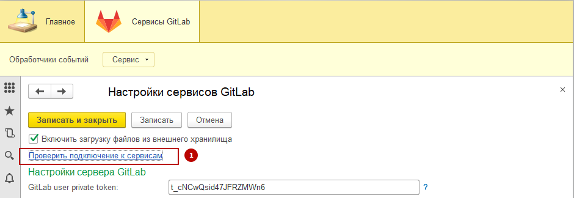

# Описание

## Суть проблемы

* Редактирование неактуальных версий внешних отчетов и обработок.
* Ручной процесс применения изменений сразу в несколько информационных баз.
* Отсутствие контроля за процессом изменения внешних отчетов и обработок.

## Цели

* Хранение внешних обработок в едином внешнем хранилище.
* Версионирование изменений.
* Автоматизированная доставка изменений до информационных баз.

## Связь с целями и стратегией

Однотипность процесса разработки, уменьшение затрат на разработку, разработка в любой среде, контроль качества кода.

## Инструменты

* Разработка ведется в [EDT](https://releases.1c.ru/project/DevelopmentTools10). Проект создан по [bootstrap-1c](https://github.com/astrizhachuk/bootstrap-1c);

* Платформа 1С не ниже v.8.3.10.2667;

* Тесты в процессе разработки при помощи [Тестер](https://github.com/grumagargler/tester) - ./test (см. gitlab-services-tester) - реализовано в виде подмодуля;

* Модульные тесты EDT [1CUnits](https://github.com/DoublesunRUS/ru.capralow.dt.unit.launcher) - в расширении, см. [./GitlabServices.Tests](./GitlabServices.Tests);

## BPMN: изменение внешней обработки

## Архитектура решения

* GitLab Enterprise Edition не ниже 11.4.0-ee.
* На конечных точках (базах получателях) должен быть реализован API обновления внешний отчетов и обработок: см. [тут](https://app.swaggerhub.com/apis-docs/astrizhachuk/epf/1.0.0) или [тут](./api-target.yaml). Пример реализации сервиса для базы-приемника - [gitlab-services-target](https://github.com/astrizhachuk/gitlab-services-target)

1. В основной ветке удаленного репозитория на GitLab осуществляется commit изменений.
2. На сервере GitLab срабатывает webhook в виде запроса по методу POST в HTTP-сервис (REST) веб-сервера 1С ИБ-распределителя.
3. HTTP-сервис 1С проводит аутентификацию и корректность тела запроса, который передается в формате JSON (application/json). Если аутентификация пройдена и данные корректны, то сразу возвращается HTTP-ответ с кодом 200, либо код ошибки и соединение с GitLab закрывается.
4. ИБ-распределителя в фоновом задании обрабатывает тело запроса одним пакетом, подготавливая данные для каждого commit внутри этого пакета:
    * с сервера GitLab для каждого commit забирается своя версия файла настроек маршрутизации данных в ИБ-получатели (файл .ext-epf.json в корне репозитория);
    * с сервера GitLab для каждого commit забирается своя версия бинарного файла с расширением *.epf,*.erf;
    * данные сохраняются в ИБ-распределителе для возможности анализа и аварийной отправке данных в ИБ-получатели;
    * подготавливаются данные для отправки согласно маршрутам доставки;
    каждый файл или действие асинхронно через Web-сервис отправляется в ИБ-получатель с получением ответа об успехе;
5. В ИБ-получателе производятся действия согласно правилам настроек маршрутизации.
6. Мониторинг ИБ-распределителя осуществляется либо через web-client, либо через тонкий клиент.

## Включение и откючение функционала

Включить или отключить процесс обработки событий от GitLab и доставку внешних обработок в базы-получатели можно в ИБ-распределителе через "Сервисы GitLab" - "Сервис" - "Настройки сервисов GitLab" флажок "Включить загрузку файлов из внешнего хранилища".

## Диагностика веб-сервисов

Проверить работоспособность веб-сервисов (отклик и ответ) можно в настройках сервисов (1):

Нажав "Проверить" можно увидеть как статус сервиса (доступен, недоступен, включен, выключен) (3), так и тело ответа (4):

## Аутентификация и авторизация

1. На сервере Gitlab для каждого репозитория в Settings → Integrations устанавливается секретный ключа (Secret Token), который будет добавляться в заголовки POST запросов для аутентификации этих запросов на стороне HTTP-сервиса 1С. Данный ключ  необходимо указать в качестве идентификатора в справочнике "Обработчики событий" в ИБ-распределителе. При срабатывании webhook в справочнике "Обработчики событий" осуществляется поиск элемента справочника с требуемым ключом (идентификатором) с последующей привязкой этого элемента к обрабатываемому webhook. Если таких элементов несколько, то будет выбран первый.

2. На сервере GitLab выбирается или добавляется новый пользователь, под которым будут забираться данные с репозитория (файлы настроек маршрутизации и бинарные файлы). На сервере данная настройка находится в персональных настройках пользователя в разделе User Settings → Access Tokens → Personal Access Tokens.  Необходимо с установить дату до которой действует ключ и Scopes = api. На стороне 1C значение этого ключа прописывается в константу "GitLab user private token" ИБ-распределителя.

3. Для ИБ-распределителя создается два файла-публикации: один для HTTP-сервиса (с урезанным доступом для тонкого клиента), другой - для доступа к базе через web-client. В самой же информационной базе создается специальный пользователь с ролью HTTPСервисGitLab (пользователь с этой ролью указывается в .vrd файле публикации), остальным пользователям, которым дается право на мониторинг сервисов GitLab, назначается роль ПользовательGitLab (см. каталог проекта ../web).

4. Для всех информационных баз, в которые необходимо отправлять внешние обработки, выбирается или добавляется новый пользователь с ролью WSGitLab. Он должен быть одним и тем же для всех этих баз. Имя такого пользователя и его пароль указывается в настройках подключения к конечной точке в ИБ-распределителе.

//TODO ...