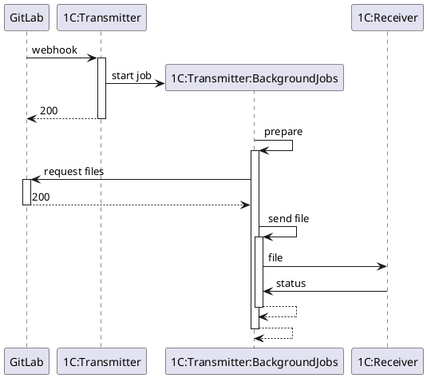
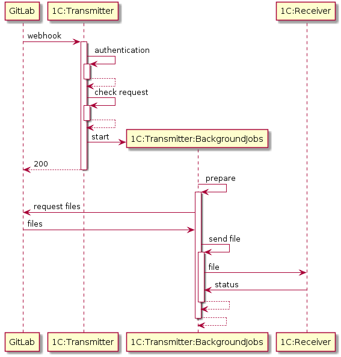

... проект в процессе разработки, релизов пока нет ...

# Описание

[](https://sonar.openbsl.ru/dashboard?id=gitlab-services)
[](https://sonar.openbsl.ru/dashboard?id=gitlab-services)

## Суть проблемы

* Редактирование неактуальных версий внешних отчетов и обработок.
* Ручной процесс применения изменений сразу в несколько информационных баз.
* Отсутствие контроля за процессом изменения внешних отчетов и обработок.

## Цели

* Хранение внешних обработок в одном месте для различных информационных баз.
* Использование системы контроля версий.
* Автоматизированная доставка изменений до информационных баз.

## Связь с целями и стратегией

Однотипность процесса разработки, уменьшение затрат на разработку, разработка в любой среде, контроль качества кода.

## Инструменты разработки

* Разработка ведется в [EDT](https://releases.1c.ru/project/DevelopmentTools10) не ниже 2020.4.0+425. Проект создан на основе [bootstrap-1c](https://github.com/astrizhachuk/bootstrap-1c);

* Платформа 1С не ниже 8.3.16.1502;

* Модульные тесты через [1CUnits](https://github.com/DoublesunRUS/ru.capralow.dt.unit.launcher) не ниже 0.4.0 - в расширении конфигурации EDT, см. [./GitlabServices.Tests](./GitlabServices.Tests);

* Среда для разработки разворачивается с помощью docker-compose, а сам продукт поставляется в виде образов [docker](https://www.docker.com)

## Процесс разработки

Предполагается следующий цикл при работе над проектом:

Начинаем...

1. Pull проекта из удаленного репозитория;

2. Разворачивание среды;

3. Разработка в EDT в ранее созданном окружении (база-данных, веб-сервер, утилиты);

4. Тестирование (юнит-тесты, функциональные и интеграционные тесты);

5. Push изменений и PR (MR) в удаленный репозиторий;

6. Прогон автоматических тестов, сборка релиза и документации на сервере;

...повторяем.

### Сборка проекта

#### Установка требуемого ПО

Например, для ```windows```, можно воспользоваться менеджером пакетов [chocolatey](https://chocolatey.org):

```bash
> tools\install-env.cmd
```

#### Клонирование проекта из удаленного репозитория

```bash
> git clone https://github.com/astrizhachuk/gitlab-services.git
```

#### Конфигурация проекта

Для самостоятельной сборки проекта необходимо предварительно установить переменные окружения. Если docker-образы уже собраны, то данный шаг не обязателен.

>ONEC_USERNAME - учётная запись на http://releases.1c.ru
>
>ONEC_PASSWORD - пароль для учётной записи на http://releases.1c.ru
>
>ONEC_VERSION - версия платформы 1С:Преприятия 8.3, для которой собирается проект
>
>DOCKER_USERNAME - учетная запись на [Docker Hub](https://hub.docker.com) или в корпоративном registry
>
Настроить подключение к серверу лицензий в файле [nethasp.ini](./tools/nethasp.ini)

Настроить в системном hosts resolve имен сервисов из файла [docker-compose.yml](./docker-compose.yml).

```bash
# srv - сервер 1С;
# gitlab - сервер gitlab;
# transmitter - веб-сервер для API и веб-клиента сервиса gitlab;
# receiver:[port] - веб-сервера для API тестовых баз (получателей)
127.0.0.1 localhost gitlab transmitter receiver
172.28.189.202 srv  #ult 172.28.189.202 - ip docker-демона
```

Местоположения hosts:

```bash
# windows
C:\Windows\System32\drivers\etc\hosts

# linux
/etc/hosts
```

#### Операции с окружением

Разворачивание окружения с предварительной сборкой образов:

```bash
> docker-compose up -d --build
```

Запуск всех сервисов:

```bash
> docker-compose start
```

Запуск выборочных сервисов:

```bash
> docker-compose start srv db transmitter
```

Остановка всех сервисов:

```bash
> docker-compose stop
```

Запуск нескольких тестовых баз-получателей (масштабированием) с веб-сервером, веб-клиентом и инициализацией базы из эталона:

```bash
# api для база_1 - receiver:8081/api/hs/gitlab/version
# client для база_1 - receiver:8081/client
# api для база_2 - receiver:8082/api/hs/gitlab/version
# client для база_2 - receiver:8082/client
# и т.д.

> docker-compose up --scale receiver=2 --build receiver
```

Пример определения IP адресов баз-получателей (для user_settings.json):

```bash
docker inspect --format="{{range .NetworkSettings.Networks}}{{.IPAddress}}{{end}}" gitlab-services_receiver_1 gitlab-services_receiver_2
```

```Runtime``` копирование файла в контейнер с толстым клиентом:

```bash
docker cp ./test/empty.dt gitlab-services_client_1:/tmp/empty.dt
```

```Runtime``` удаление всех данных (в т. ч. пользователей) в информационной базе через пакетный режим запуска:

```bash
docker exec gitlab-services_client_1 bash -c "/opt/1C/v8.3/x86_64/1cv8 DESIGNER /S 'srv\gitlabServices' /N'Администратор' /EraseData /DisableStartupDialogs"
```

```Runtime``` загрузка в ранее очищенную базу dt-файла эталонной тестовой базы через пакетный режим запуска:

```bash
# вариант для загрузки dt-файла, переданного в контейнер при его создании
docker exec gitlab-services_client_1 bash -c "/opt/1C/v8.3/x86_64/1cv8 DESIGNER /S 'srv\gitlabServices' /RestoreIB /home/usr1cv8/empty.dt /DisableStartupDialogs"

# вариант для загрузки dt-файла, ранее переданного в runtime
docker exec gitlab-services_client_1 bash -c "/opt/1C/v8.3/x86_64/1cv8 DESIGNER /S 'srv\gitlabServices' /RestoreIB /tmp/empty.dt /DisableStartupDialogs"
```

```Runtime``` загрузка в "испорченную" базу dt-файла эталонной тестовой базы через пакетный режим запуска:

```bash
# вариант для загрузки dt-файла, переданного в контейнер при его создании
docker exec gitlab-services_client_1 bash -c "/opt/1C/v8.3/x86_64/1cv8 DESIGNER /S 'srv\gitlabServices' /N'Администратор' /RestoreIB /home/usr1cv8/empty.dt /DisableStartupDialogs"

# вариант для загрузки dt-файла, ранее переданного в runtime
docker exec gitlab-services_client_1 bash -c "/opt/1C/v8.3/x86_64/1cv8 DESIGNER /S 'srv\gitlabServices' /N'Администратор' /RestoreIB /tmp/empty.dt /DisableStartupDialogs"
```

> Помни! EDT может блокировать монопольный доступ к базе (запущен агент), что препятствует загрузке dt-файла. Перед загрузкой dt-файлов необходимо удалять блокирующие процессы на клиенте (либо закрывать EDT).

Пример, как сложное сделать простым:

(тестирование в ```vanessa-automation```  в среде ```linux``` на ```windows``` при наличии ```WSL2``` подключившись "сбоку" еще одним контейнером)

```bash
> docker run --rm \
    -it -p 5901:5900/tcp \
    --env-file=.env.docker \
    --network=gitlab-services_back_net \
    -v gitlab-services_client_data:/home/usr1cv8/.1cv8 \
    -v $PWD/tools/nethasp.ini:/opt/1C/v8.3/x86_64/conf/nethasp.ini \
    -v $PWD/tools/VAParams.json:/home/usr1cv8/VAParams.json \
    -v $PWD/:/home/usr1cv8/project \
    ${DOCKER_USERNAME}/client-vnc-va:${ONEC_VERSION}

```

В файле [.env.docker](./.env.docker) указываются параметры запуска толстого клиента в контейнере.

> Помни! В файлах ```linux``` перевод строки - ```LF```, а в ```windows``` - ```CRLF```

## BPMN: изменение внешней обработки


## Архитектура решения

* Описание API [тут](https://app.swaggerhub.com/apis-docs/astrizhachuk/gitlab-services/1.0.0) или [тут](./api-gitlab-services.yaml).
* GitLab Enterprise Edition не ниже 11.4.0-ee.
* На конечных точках (базах получателях) должен быть реализован API обновления внешний отчетов и обработок: см. [тут](https://app.swaggerhub.com/apis-docs/astrizhachuk/gitlab-services-receiver/1.0.0) или [тут](./api-receiver.yaml). Пример реализации сервиса для базы-приемника - [gitlab-services-receiver](https://github.com/astrizhachuk/gitlab-services-receiver)






1. В основной ветке удаленного репозитория на GitLab осуществляется commit изменений.
2. На сервере GitLab срабатывает webhook в виде запроса по методу POST в HTTP-сервис (REST) веб-сервера 1С ИБ-распределителя.
3. HTTP-сервис 1С проводит аутентификацию и корректность тела запроса, который передается в формате JSON (application/json). Если аутентификация пройдена и данные корректны, то сразу возвращается HTTP-ответ с кодом 200, либо код ошибки и соединение с GitLab закрывается.
4. ИБ-распределителя в фоновом задании обрабатывает тело запроса одним пакетом, подготавливая данные для каждого commit внутри этого пакета:
    * с сервера GitLab для каждого commit забирается своя версия файла настроек маршрутизации данных в ИБ-получатели (файл .ext-epf.json в корне репозитория);
    * с сервера GitLab для каждого commit забирается своя версия бинарного файла с расширением *.epf,*.erf;
    * данные сохраняются в ИБ-распределителе для возможности анализа и аварийной отправке данных в ИБ-получатели;
    * подготавливаются данные для отправки согласно маршрутам доставки;
    каждый файл или действие асинхронно через Web-сервис отправляется в ИБ-получатель с получением ответа об успехе;
5. В ИБ-получателе производятся действия согласно правилам настроек маршрутизации.
6. Мониторинг ИБ-распределителя осуществляется либо через web-client, либо через тонкий клиент.

## Включение и отключение функционала

Включить или отключить процесс обработки событий от GitLab и доставку внешних обработок в базы-получатели можно в ИБ-распределителе через "Сервисы GitLab" - "Сервис" - "Настройки сервисов GitLab" флажок "Включить загрузку файлов из внешнего хранилища".

## Диагностика веб-сервисов

Проверить работоспособность веб-сервисов (отклик и ответ) можно в настройках сервисов (1):


Нажав "Проверить" можно увидеть как статус сервиса (доступен, недоступен, включен, выключен) (3), так и тело ответа (4):


## Аутентификация и авторизация

1. На сервере Gitlab для каждого репозитория в Settings → Integrations устанавливается секретный ключа (Secret Token), который будет добавляться в заголовки POST запросов для аутентификации этих запросов на стороне HTTP-сервиса 1С. Данный ключ  необходимо указать в качестве идентификатора в справочнике "Обработчики событий" в ИБ-распределителе. При срабатывании webhook в справочнике "Обработчики событий" осуществляется поиск элемента справочника с требуемым ключом (идентификатором) с последующей привязкой этого элемента к обрабатываемому webhook. Если таких элементов несколько, то будет выбран первый.


2. На сервере GitLab выбирается или добавляется новый пользователь, под которым будут забираться данные с репозитория (файлы настроек маршрутизации и бинарные файлы). На сервере данная настройка находится в персональных настройках пользователя в разделе User Settings → Access Tokens → Personal Access Tokens.  Необходимо с установить дату до которой действует ключ и Scopes = api. На стороне 1C значение этого ключа прописывается в константу "GitLab user private token" ИБ-распределителя.


3. Для ИБ-распределителя создается два файла-публикации: один для HTTP-сервиса (с урезанным доступом для тонкого клиента), другой - для доступа к базе через web-client. В самой же информационной базе создается специальный пользователь с ролью HTTPСервисGitLab (пользователь с этой ролью указывается в .vrd файле публикации), остальным пользователям, которым дается право на мониторинг сервисов GitLab, назначается роль ПользовательGitLab (см. каталог проекта ../web).

4. Для всех информационных баз, в которые необходимо отправлять внешние обработки, выбирается или добавляется новый пользователь с ролью WSGitLab. Он должен быть одним и тем же для всех этих баз. Имя такого пользователя и его пароль указывается в настройках подключения к конечной точке в ИБ-распределителе.


//TODO ...