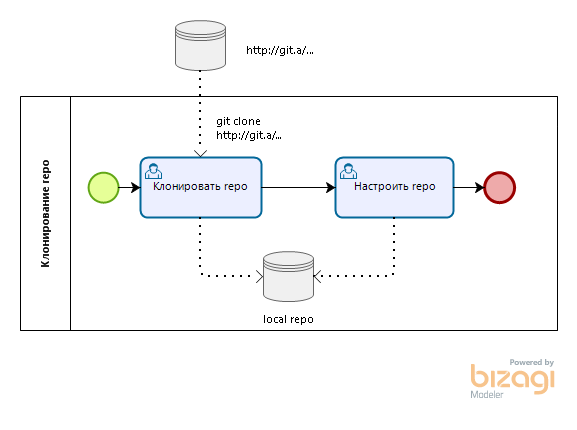
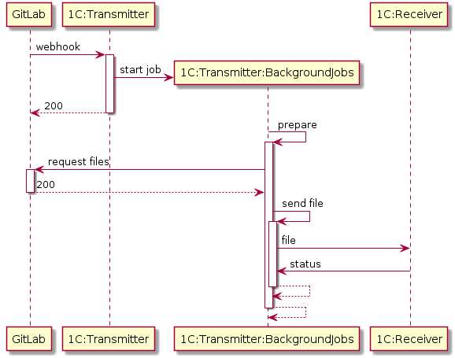

# Описание

[](https://github.com/astrizhachuk/epf-transmitter/releases/latest)
[](https://sonar.openbsl.ru/dashboard?id=epf-transmitter)
[](https://sonar.openbsl.ru/dashboard?id=epf-transmitter)

## Суть проблемы

* Редактирование неактуальных версий внешних отчетов и обработок.
* Ручной процесс применения изменений сразу для нескольких информационных баз.
* Отсутствие контроля за процессом изменения внешних отчетов и обработок.

## Цели

* Хранение внешних обработок в одном месте для различных информационных баз.
* Использование системы контроля версий.
* Автоматизированная доставка изменений до информационных баз.

## Связь с целями и стратегией

Однотипность процесса разработки, уменьшение затрат на разработку, разработка в любой среде, контроль качества кода.

## Решение

- Хранить внешние обработки в системах управления репозиториями программного кода для распределенной системы контроля версий Git.

    * GitLab Enterprise Edition не ниже 11.4.0-ee.
    * ...

- Разработать веб-сервисы и клиент для интеграции с внешними хранилищами кода.

    === "local"

        https://github.com/astrizhachuk/epf-transmitter/tree/master/api/transmitter.yml

    === "swagger"

        https://app.swaggerhub.com/apis-docs/astrizhachuk/epf-transmitter

    === "postman"

        https://documenter.getpostman.com/view/3977639/UVJbHcxQ

- Реализовать в информационных базах получателях API обновления внешний отчетов и обработок. [Пример](https://github.com/astrizhachuk/epf-endpoint) подобной реализации.

    === "local"

        https://github.com/astrizhachuk/epf-transmitter/tree/master/api/endpoint.yml

    === "swagger"

        https://app.swaggerhub.com/apis-docs/astrizhachuk/epf-endpoint

    === "postman"

        https://documenter.getpostman.com/view/3977639/UVCCe3qs

### BPMN: изменение внешней обработки




### Интеграция с внешними хранилищами кода

#### GitLab

Информация об изменении кода во внешнем хранилище поступает через систему оповещения о событиях (webhooks).



??? example "plantuml"

    ``` plantuml
    @startuml
    GitLab -> "1C:Transmitter" ++ : webhook
    "1C:Transmitter" -> "1C:Transmitter:BackgroundJobs" ** : start job
    return 200
    "1C:Transmitter:BackgroundJobs" -> "1C:Transmitter:BackgroundJobs" ++ : prepare
    GitLab <- "1C:Transmitter:BackgroundJobs" ++ : request files
    return 200
    "1C:Transmitter:BackgroundJobs" -> "1C:Transmitter:BackgroundJobs" ++ : send file
    "1C:Transmitter:BackgroundJobs" -> "1C:Endpoint" : file
    "1C:Transmitter:BackgroundJobs" <- "1C:Endpoint" : status
    return
    return
    @enduml
    ```

1. Для контролируемой ветки в удаленном репозитории на сервере GitLab выполняется некоторое событие.
2. На сервере GitLab срабатывает webhook в виде запроса по методу POST к HTTP-сервису 1С `epf-transmitter`.
3. Веб-сервис `epf-transmitter` проводит аутентификацию и проверяет данные запроса, переданный в формате `json (application/json)`. Если аутентификация пройдена и данные корректны, то возвращается HTTP-ответ с кодом 200. В противном случае - код ошибки.
4. Веб-сервис `epf-transmitter` в фоновом задании обрабатывает тело запроса, подготавливая данные для каждого `commit` из запроса:
    * с сервера GitLab для каждого `commit` забирается своя версия файла настроек маршрутизации данных по базам-получателям (по умолчанию, файл`.ext-epf.json` в корне репозитория);
    * с сервера GitLab для каждого `commit` забирается своя версия бинарного файла с расширением `*.epf, *.erf`;
    * данные сохраняются в `epf-transmitter` для возможности анализа и повторной отправки данных;
    * подготавливаются данные согласно маршрутам доставки;
    * каждый файл в своем фоновом задании отправляется в информационную базу-приемник с сохранением данных о результатах доставки;
